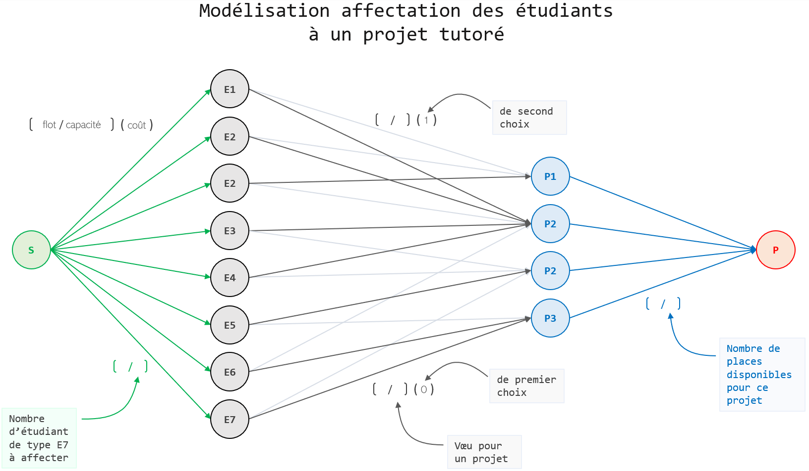

# Ford-Fulkerson & MaxFlow-MinCost

## Guide d'utilisation sous Linux
### Commandes générales
#### VSCodium
##### Compilation
``` 
CTRL + SHIFT + B      
``` 
##### Exécution
``` 
./ftest graphe.txt src dest graphe.gv --option_import --option_algo --option_export     
``` 
######     --option_import :
```
--fromGfile        // ouvrir un fichier graph 
``` 
```
--fromaffect       // ouvrir un fichier d'affectation
``` 
######     --option_algo :
```
--fordF            // algorithme de Ford-Fulkerson 
```
```
--fordFverbose     // algorithme de Ford-Fulkerson avec affichage des chemins empruntés
``` 
```
--minFmaxC         // algorithme de min-flow max-cost
``` 
```
--minFmaxCverbose  // algorithme de min-flow max-cost avec affichage des chemins empruntés
``` 
######     --option_export :
```
--visible          // graphe représentant chaque arc et labels
```
```
--easygraph        // graphe épuré
``` 
```
--text             // tableau du résultat d'affectation (disponible qu'avec --fromaffect)
``` 
##### transfert GV file → SVG file
``` 
dot -Tsvg graph.gv > graph.svg                                                               
``` 
#### ocamlbuild
```
à remplir 
```
### Exemples 
#### Test de **Ford-Fulkerson** avec chemin empruntant un arc retour du graphe d'écart
`./ftest exemples/graph_1 src dest exemples/graph1.gv --fromGfile --fordF --visible` </br>
`dot -Tsvg exemples/graph_1.gv > exemples/graph1.svg` 
#### Test de **Ford-Fulkerson** sur un petit graphe d'affectation 
`./ftest exemples/graph_2 src dest exemples/graph_2fF.gv --fromaffect --fordF --easygraph` </br>
`dot -Tsvg exemples/graph_2fF.gv > exemples/graph_2fF.svg` 
#### Test de **MaxFlow-MinCost** sur le même petit graphe d'affectation (prise en compte de l'ordre des voeux)
`./ftest exemples/graph_2 src dest exemples/graph_2mFmC.gv --fromaffect --maxFminC --text` </br>
`dot -Tsvg exemples/graph_2mFmC.gv > exemples/graph_2mFmC.svg` 
#### Test de **MaxFlow-MinCost** sur un plus grand graphe d'affectation
`./ftest exemples/graph_3 src dest exemples/graph_3.gv --fromaffect --maxFminC --text` </br>
`dot -Tsvg exemples/graph_3.gv > exemples/graph_3.svg` 
## Choix d'implémentation
### Implémentation du graphe
#### arcs_out
```
[ ( • id node destination, --α--> ) ;
  ( • id node destination, --α--> ) ;
  ( • id node destination, --α--> ) ;
  ( • id node destination, --α--> ) ;
  ( • id node destination, --α--> ) ;
  ( • id node destination, --α--> ) ]
  ```  
#### graph
```
[ ( • id node source , [ ( • id node destination, --α--> ) ;
                         ( • id node destination, --α--> ) ;
                         ( • id node destination, --α--> ) ;
                         ( • id node destination, --α--> ) ;
                         ( • id node destination, --α--> ) ;
                         ( • id node destination, --α--> ) ] ) ;
  ( • id node source , [ ( • id node destination, --α--> ) ;
                         ( • id node destination, --α--> ) ;
                         ( • id node destination, --α--> ) ;
                         ( • id node destination, --α--> ) ;
                         ( • id node destination, --α--> ) ] ) ;
  ( • id node source , [ ( • id node destination, --α--> ) ;
                         ( • id node destination, --α--> ) ;
                         ( • id node destination, --α--> ) ;
                         ( • id node destination, --α--> ) ;
                         ( • id node destination, --α--> ) ;
                         ( • id node destination, --α--> ) ] ) ;
  ( • id node source , [] ) ;                          
  ( • id node source , [ ( • id node destination, --α--> ) ;
                         ( • id node destination, --α--> ) ;
                         ( • id node destination, --α--> ) ] ) ]
```
#### labels utilisés --α-->
```
type labels = { max: int;           // capacité de l'arc
                current: int;       // flot parcourant l'arc
                visited: bool;      // marquage des arcs visités pour la recherche de chemin 
                cost: int }         // coût de l'arc pour l'algorithme de MaxFlow-MinCost                     
```
## Le problème de l'affectation des étudiants à un projet tutoré au nombre de places limité  
### Contexte
Des sujets de projets tutorés sont proposés à des étudiants.</br>
Les étudiants doivent émettre deux vœux d'affectation.</br>
Pour chaque projet un nombre de places disponibles est attribué.
### Modélisation pour une application d'un algorithme de flot

Les E<sub>i</sub> représentent les étudiants.</br>
Les P<sub>j</sub> représentent les projets proposés.</br>
Les nœuds source S et puits P sont rajoutés de telle sorte que le flot de S à P fait sens au regard du problème soumis :</br>
  • les capacités des arcs S → E<sub>i</sub> représentent le nombre d'étudiant de type E<sub>i</sub> (dans nos exemples toujours 1)</br>
  • les capacités des arcs E<sub>i</sub> → P<sub>j</sub> représentent les voeux des étudiants (1 : projet choisi ; 0 : projet non choisi)</br>
  • les capacités des arcs P<sub>j</sub> → P représentent le nombre de places disponibles</br>
  • un flot de 1 sur un chemin S → E<sub>i</sub> → P<sub>j</sub> → P signifie que E<sub>i</sub> a été affecté au projet P<sub>j</sub>
### Format d'entrée
La soumission du projet `nomcomplet` raccourcis à `ptitnom` (unique) au nombre de place limité à `nbPlaceDispo` se fait de la manière suivante :
```
p ptitnom nbPlaceDispo nomcomplet
```
L'émission d'un vœu d'un étudiant aux initiales `TB` pour les projets `projet1` et `projet2` se fait de la manière suivante :
```
e TB projet1 projet2
```
voir un [exemple](exemples/graph_2)

